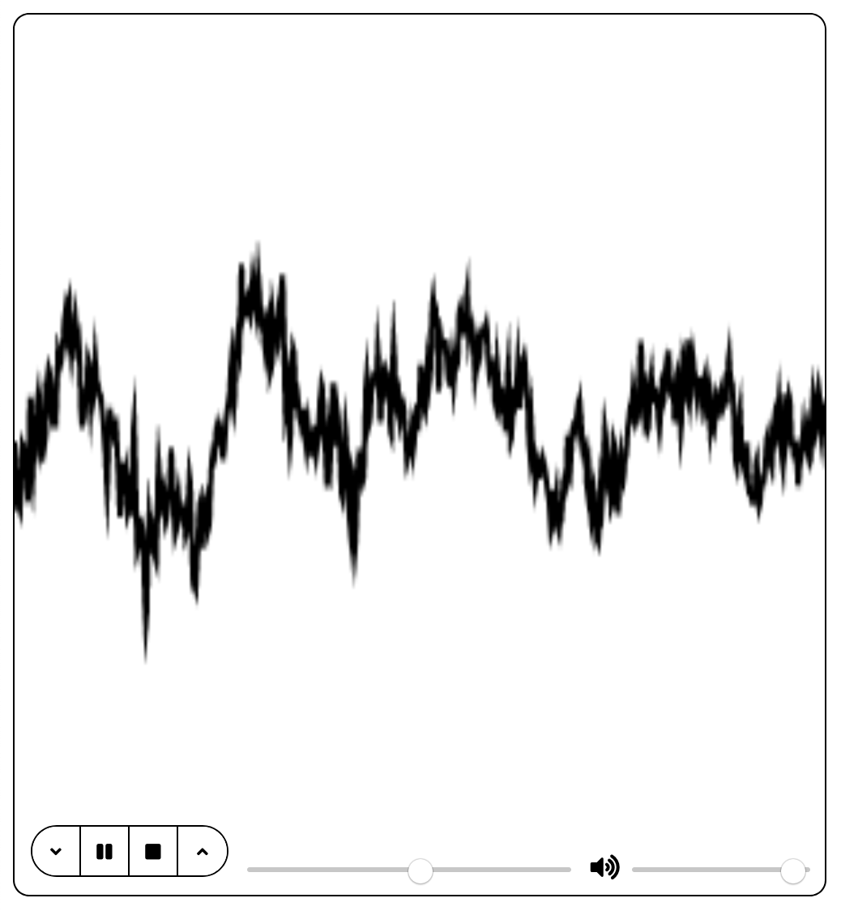

# Домашнее задание. Медиа

Необходимо сверстать и реализовать аудиоплеер с нестандартным интерфейсом, расширяющий функциональность встроенного браузерного плеера.

После текста задания находится ссылка со скриншотами/анимацией, начальным index.html и необходимыми библиотеками

# Внешний вид

# Описание функциональности

1.  Интерфейс содержит кнопки "Замедлить воспроизведение" "Воспроизведение/Пауза" "Стоп" "Ускорить воспроизведение". См. раздел "Кнопки"
2.  Справа от кнопок находится "слайдер" - элемент управления, отображающий текущее место в треке, которое играется в данный момент, а также позволяющий "перемотать" трек на произвольное место. См. раздел "Индикация проигрывания и перемотка трека"
3.  Справа расположен еще один "слайдер", который управляет громкостью воспроизведения. Рядом с ним находится иконка, которая отображает текущее состояние слышимости трека (становится перечеркнутой, если трек неслышим) (См. раздел "Управление звуком")
4.  Над всеми элементами управления расположен "осцилограф", визуализирующий звук, выводимый при проигрывании. См. раздел "Визуализация"

# Индикация проигрывания и перемотка трека

Для демонстрации точки трека, которая в данный момент проигрывается, используется слайдер с управляющим элементом - ползунком - на нем. Управляющий элемент движется по мере того, как трек играет. За него можно потянуть, и трек будет перескакивать по мере перетаскивания на те точки, где будет находится ползунок. Важно, чтобы музыка переключалась именно по мере перетаскивания, а не только после того, как пользователь уже отпустил ползунок.

# Управление звуком

Для регулирования громкости и используется еще один слайдер. Он используется для индикации и регулирования громкости. Перед началом проигрывания трека, громкость полная. Важно, чтобы громкость изменялась сразу по мере перетаскивания ползунка, а не только после его отпускания.

# Визуализация

Над элементами управления расположен canvas, на который нужно вывести визуальные эффекты, связанные с проигрываемой музыкой. Используя объект AudioContext (или любым другим способом) получите информацию о волновых характеристиках проигрываемого в данный момент звука и выведите анимацию, связанную с этими цифрами на canvas.
Плюсом будет, если для вывода будет задействована библиотека Paper.js (прилагается вместе с документацией, вместе с прочими файлами по ссылке внизу). Пример анимации при использовании Paper.js в файле 2.gif (также прилагается по ссылке)
Плюсом также будет, если анимация будет иметь форму кольца (пример анимации на скриншоте circle.png и файле 2.gif, внутри прилагаемого архива)

# Замечание

Внешний вид слайдера может несколько отличаться, в зависимости от браузера
Браузер может не позволять загрузить аудио-файл без локального веб-сервера. Если это так (вы видите ошибки, связанные с CORS в консоли) - вам потребуется либо установить локальный сервер, либо сменить браузер

# Правила оценивания

Задача оценивается по критериям:

1.  Функциональность плеера, соотвествие функционирования кнопок условию Это необходимое условие и без него прочие пункты не проверяются (2 балла)
2.  Наличие "осцилографа" с эффектами, связанного с проигрываемой музыкой (+6 баллов)
3.  Используется Paper.js (+2 балла)
4.  Анимация имеет форму кольца (+2 балла)

[Скачать условие задачи](https://yadi.sk/d/PY_EwgLj-m4fgA)

